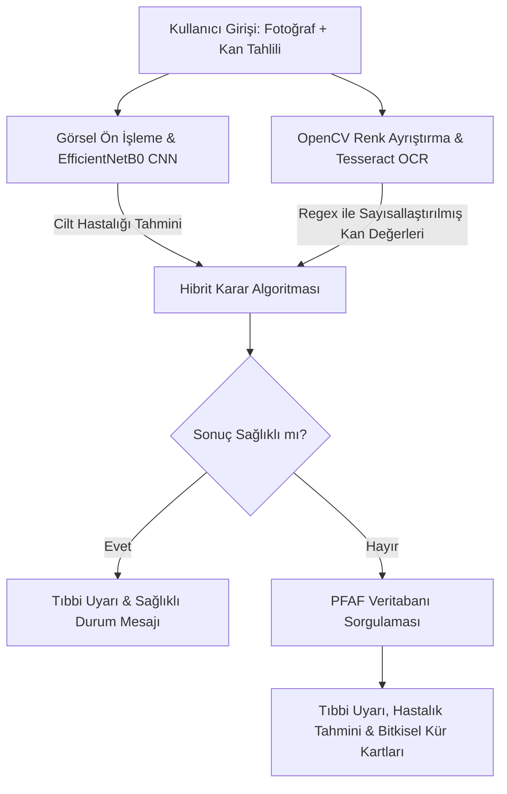

# 🌿 Tahlil Analizi Destekli Bitkisel Cilt ve Saç Danışmanı

> **Yapay zekâ destekli, multimodal (çoklu modaliteli) cilt ve saç danışmanlığı sistemi**

<p align="center">
  
  
  
  
  
  
</p>

---

##  Proje Hakkında

**Tahlil Analizi Destekli Bitkisel Cilt ve Saç Danışmanı**, cilt görüntülerini ve kan tahlili verilerini birlikte değerlendirerek kullanıcıya yapay zekâ destekli bir danışmanlık deneyimi sunmayı amaçlayan **multimodal bir karar destek sistemi**dir.

Geleneksel yalnızca görüntü tabanlı yaklaşımlardan farklı olarak sistem, kullanıcının:

*  **Cilt görüntüsünü**
*  **Kan tahlili sonuçlarını**
*  **Bitkisel tedavi veri tabanını**

birlikte değerlendirir.

Cilt görüntüsü, **EfficientNetB0** tabanlı derin öğrenme modeli ile analiz edilirken; tahlil görüntüleri **OpenCV + Tesseract OCR + Regex** kullanılarak sayısallaştırılır. Elde edilen sonuçlar hibrit bir karar algoritması ile birleştirilerek kullanıcıya hastalık tahminleri ve ilgili bitkisel öneriler sunulur.

> ⚠️ **Önemli:** Bu proje tıbbi teşhis koymaz. Bir **danışmanlık ve karar destek prototipidir**. Kullanıcıların elde edilen sonuçları değerlendirmeden veya herhangi bir bitkisel uygulamaya başlamadan önce sağlık uzmanına danışması gerekir.

---

##  Projenin Amacı

Projenin temel amacı, cilt ve saç problemlerini yalnızca görsel veriler üzerinden değerlendirmek yerine, kullanıcıların laboratuvar sonuçlarını da sisteme dahil ederek daha bütüncül bir danışmanlık mekanizması oluşturmaktır.

### Temel hedefler

* Cilt görüntülerinden olası dermatolojik sınıfı tahmin etmek
* Kan tahlili görüntülerini otomatik olarak okuyabilmek
* Önemli laboratuvar değerlerini sayısallaştırmak
* Referans aralıklarına göre değerleri değerlendirmek
* Görüntü ve tahlil analizlerini tek bir karar mekanizmasında birleştirmek
* Hastalıklarla ilişkili bitkisel önerileri kullanıcıya sunmak
* Modeli bulut ortamında çalıştırarak mobil ve web istemcilerine açmak
* Kullanıcıya erişilebilir bir mobil/web arayüzü sağlamak

---

#  Sistem Nasıl Çalışıyor?

Sistem temel olarak iki farklı veri kaynağını işler:


---

#  Yapay Zekâ Modeli

## EfficientNetB0

Cilt hastalıklarının sınıflandırılması için **ImageNet ağırlıklarıyla başlatılmış EfficientNetB0** mimarisi kullanılmıştır.

Model, **Transfer Learning** yaklaşımıyla eğitilmiş ve son katmanları projedeki dermatolojik sınıflara göre düzenlenmiştir.

Modelin değerlendirilmesinde **K-Fold Cross Validation** yaklaşımından yararlanılmıştır.

### Model sınıfları

Model toplam **10 farklı sınıfı** sınıflandırmaktadır:

| #  | Sınıf       |
| -- | ----------- |
| 1  | Acne        |
| 2  | Alerji      |
| 3  | Benign      |
| 4  | Eczema      |
| 5  | Hairloss    |
| 6  | Healthy     |
| 7  | Mantar      |
| 8  | Nail Fungus |
| 9  | Rosacea     |
| 10 | Vitiligo    |

### Model Başarımı

Model, dengelenmiş 10 sınıflı SkinDisease veri seti üzerinde:

> **%92 genel doğruluk (Accuracy)**

başarımına ulaşmıştır.

Veri setinin dengelenmesi için:

* Data Cleaning
* Data Augmentation
* Undersampling

tekniklerinden yararlanılmıştır.

---

#  Tahlil Görüntüsü Analizi

Sistemin önemli özelliklerinden biri, kullanıcının kan tahlili ekran görüntüsünü doğrudan sisteme verebilmesidir.

Özellikle renkli ve gürültülü sağlık platformu ekranlarında standart OCR sistemlerinin yaşayabileceği okuma problemlerini azaltmak amacıyla görüntü ön işleme uygulanmaktadır.

### İşlem pipeline'ı

```text
Tahlil Görüntüsü
       │
       ▼
   OpenCV
       │
       ▼
Channel Splitting
       │
       ▼
Thresholding
       │
       ▼
Tesseract OCR
       │
       ▼
Metin Çıkarma
       │
       ▼
Regex Filtreleme
       │
       ▼
Sayısal Kan Değerleri
```

Sistem aşağıdaki temel parametreleri metin içerisinden çıkarmak üzere yapılandırılmıştır:

* Ferritin
* B12
* D Vitamini
* Çinko
* Glukoz
* IgE

Bu değerler daha sonra sistemde tanımlanan referans aralıklarıyla karşılaştırılır.

---

# 🌿 Bitkisel Öneri Sistemi

Sistemde hastalıklarla ilişkilendirilmiş bitkisel öneriler için yapılandırılmış bir **CSV tabanlı veri seti** kullanılmaktadır.

Veri tabanı içerisinde:

*  Bitki adı
*  Latince adı
*  Tıbbi rolü
*  Kullanılan bitki kısmı
*  Dozaj bilgisi
*  Hazırlama yöntemi
*  İlişkili hastalık

gibi bilgiler bulunmaktadır.

Veriler **Plants For A Future (PFAF)** kaynağından derlenmiş ve hastalık eşleştirmeleriyle birlikte sisteme entegre edilmiştir.

---

# 🔀 Hibrit Karar Algoritması

Projenin en önemli noktalarından biri, cilt görüntüsü ve kan tahlili analizlerinin birbirinden bağımsız bırakılmamasıdır.

İki farklı analiz sonucundan elde edilen bitkisel öneriler birleştirilir.

```python
image_recommendations
        +
blood_recommendations
        │
        ▼
      SETS
        │
        ▼
Duplicate Removal
        │
        ▼
Unique Recommendations
```

Python **Set** veri yapısı kullanılarak iki farklı kaynaktan gelen mükerrer öneriler temizlenir.

Böylece kullanıcıya aynı bitkinin tekrar tekrar gösterilmesi engellenerek daha temiz bir çıktı oluşturulur.

---

#  Sistem Mimarisi

Proje katmanlı ve dağıtık bir mimari kullanmaktadır.

```text
┌──────────────────────────────────────────────┐
│                 CLIENT LAYER                 │
│                                              │
│       Flutter       Web        Windows       │
│        📱           🌐           🖥️          │
└──────────────────────┬───────────────────────┘
                       │
                       │ REST API
                       ▼
┌──────────────────────────────────────────────┐
│                  API LAYER                   │
│                                              │
│                  Flask                      │
│              RESTful Backend                 │
└──────────────────────┬───────────────────────┘
                       │
          ┌────────────┼─────────────┐
          │            │             │
          ▼            ▼             ▼
     CNN Model      OCR Module   Plant Database
   EfficientNetB0   OpenCV +       CSV/Pandas
                    Tesseract
          │            │             │
          └────────────┼─────────────┘
                       │
                       ▼
              Hybrid Decision Layer
                       │
                       ▼
                 Recommendations
```

Backend tarafı **Python Flask** ile geliştirilmiş ve RESTful API mimarisi kullanılmıştır.

Model ve API, **Hugging Face Spaces** üzerinde bulut ortamına taşınarak istemcilerin backend ile iletişim kurması sağlanmıştır.

---

#  MLOps ve Deployment

Proje yalnızca localhost üzerinde çalışan bir prototip olarak bırakılmamıştır.

Backend:

* Python
* Flask
* RESTful API
* Hugging Face Spaces
* CORS

kullanılarak bulut ortamına taşınmıştır.

Bu sayede mobil ve web istemcileri modelin çalışması için kendi cihazlarında yüksek hesaplama gücüne ihtiyaç duymaz.

```text
Mobile / Web Client
        │
        │ HTTP Request
        ▼
Hugging Face Spaces
        │
        ▼
     Flask API
        │
        ├── EfficientNetB0
        ├── OCR
        ├── Regex
        └── Plant Database
        │
        ▼
      JSON Response
```

---

#  Platformlar

Proje birden fazla istemci platformunu destekleyecek şekilde geliştirilmiştir.

### Android

Flutter kullanılarak Android cihazlarda çalışabilen bir mobil uygulama geliştirilmiş ve APK çıktısı oluşturulmuştur.

###  Web

Flask backend ile haberleşen web tabanlı bir kullanıcı arayüzü geliştirilmiştir.

###  Windows

Python/Flask tabanlı uygulama Windows üzerinde bağımsız çalışabilecek **EXE** formatına dönüştürülmüştür.

Bu sayede proje:

```text
Android 📱
    +
Web 🌐
    +
Windows 🖥️
```

üzerinden kullanılabilecek şekilde genişletilmiştir.

---

#  Kullanılan Teknolojiler

| Teknoloji                  | Kullanım Alanı                    |
| -------------------------- | --------------------------------- |
|  Python 3.11             | Backend, AI, OCR                  |
|  TensorFlow / Keras      | Derin öğrenme                     |
|  EfficientNetB0         | Cilt hastalığı sınıflandırma      |
|  Flask                   | RESTful API                       |
|  OpenCV                 | Görüntü ön işleme                 |
|  Tesseract OCR           | Tahlil metni çıkarma              |
|  Regex                   | Kan değerlerini metinden ayıklama |
|  Pandas                  | Bitkisel veri tabanı işlemleri    |
|  Scikit-Learn            | Model doğrulama                   |
|  Flutter                 | Mobil uygulama                    |
|  HTML / CSS / JavaScript | Web arayüzü                       |
|  Hugging Face Spaces     | Cloud deployment                  |
|  Dart                    | Flutter geliştirme                |
|  Windows EXE            | Masaüstü uygulaması               |

---

#  Proje Yapısı

> Aşağıdaki yapı, repository'deki gerçek klasör adlarına göre küçük değişiklikler gerektirebilir. GitHub'ın dosya sistemini tahmin etmek insanlığın yeni bir mesleği olmamalı.

```text
📦 Bitkisel-Danisman
│
├── 📁 backend/
│   ├── app.py
│   ├── requirements.txt
│   ├── 📁 model/
│   │   └── EfficientNetB0 model files
│   ├── 📁 data/
│   │   └── bitkiler_by_disease.csv
│   └── ...
│
├── 📁 flutter/
│   ├── lib/
│   │   └── main.dart
│   ├── pubspec.yaml
│   └── ...
│
├── 📁 web/
│   ├── index.html
│   ├── style.css
│   └── script.js
│
├── 📁 model/
│   └── trained model files
│
├── 📄 README.md
└── 📄 requirements.txt
```

---

#  Kurulum

## 1️⃣ Repository'yi klonla

```bash
git clone https://github.com/KULLANICI_ADIN/REPOSITORY_ADI.git
cd REPOSITORY_ADI
```

## 2️⃣ Python sanal ortamı oluştur

```bash
python -m venv venv
```

### Windows

```bash
venv\Scripts\activate
```

### Linux / macOS

```bash
source venv/bin/activate
```

## 3️⃣ Gerekli Python paketlerini yükle

```bash
pip install -r requirements.txt
```

## 4️⃣ Tesseract OCR kurulumu

Sistemin tahlil görüntülerindeki metinleri okuyabilmesi için **Tesseract OCR** gereklidir.

Tesseract kurulumundan sonra Python tarafında `pytesseract` üzerinden kullanılabilir.

## 5️⃣ Flask backend'i çalıştır

```bash
python app.py
```

Backend çalıştıktan sonra API istemcilerden gelen analiz isteklerini işleyebilir.

---

#  API Yapısı

Backend Flask tabanlı RESTful API olarak tasarlanmıştır.

Projede temel olarak aşağıdaki analiz işlemleri bulunmaktadır:

### `/analyze`

Cilt görüntüsünün analiz edilmesi ve model tarafından hastalık sınıfının tahmin edilmesi için kullanılır.

### `/analyze/scan_blood_image`

Kan tahlili görüntüsünün:

```text
Image
  ↓
OpenCV
  ↓
OCR
  ↓
Regex
  ↓
Blood Values
```

akışı üzerinden işlenmesini sağlar.

### `/analyze/get_random_patient`

Test/demo süreçlerinde kullanılmak üzere örnek hasta verisinin alınmasını sağlar.

---

#  Örnek Sistem Akışı

Kullanıcı sisteme bir cilt görüntüsü yüklediğinde:

```text
 Image
   ↓
Preprocessing
   ↓
EfficientNetB0
   ↓
Top Predictions
   ↓
Disease Mapping
   ↓
 Plant Recommendations
```

Kan tahlili yüklendiğinde:

```text
 Blood Test Image
        ↓
      OpenCV
        ↓
 Channel Splitting
        ↓
   Thresholding
        ↓
   Tesseract OCR
        ↓
       Regex
        ↓
Blood Parameters
        ↓
Reference Range Comparison
        ↓
 Plant Recommendations
```

Her iki veri kaynağı birlikte kullanıldığında:

```text
             Cilt Analizi
                  │
                  ▼
        Disease Recommendations
                  │
                  │
                  ├──────────┐
                  │          │
                  ▼          ▼
             ┌──────────────────┐
             │ Hybrid Decision  │
             │     Algorithm    │
             └────────┬─────────┘
                      │
             Duplicate Removal
                      │
                      ▼
               Final Results
```

---

#  Tıbbi Güvenlik

Bu proje sağlık alanında yapay zekâ kullanımını araştıran bir **prototip karar destek sistemi** olarak geliştirilmiştir.

Uygulamada kullanıcıya açık şekilde:

> **Bu uygulama tıbbi teşhis koymaz.**

uyarısı gösterilir.

Ayrıca herhangi bir bitkisel uygulama veya önerinin kullanılmasından önce sağlık uzmanına danışılması gerektiği belirtilmektedir.

Sisteme zorunlu bir **Tıbbi Uyarı ve Aydınlatma Katmanı** eklenmiştir.

---

#  Sonuçlar

Proje kapsamında planlanan temel iş paketlerinin tamamı gerçekleştirilmiştir.

| Özellik                    | Durum        |
| -------------------------- | ------------ |
| Literatür araştırması      | ✅ Tamamlandı |
| Veri toplama ve etiketleme | ✅ Tamamlandı |
| Veri temizleme             | ✅ Tamamlandı |
| Data Augmentation          | ✅ Tamamlandı |
| Undersampling              | ✅ Tamamlandı |
| EfficientNetB0 eğitimi     | ✅ Tamamlandı |
| Bitkisel veri tabanı       | ✅ Tamamlandı |
| OCR entegrasyonu           | ✅ Tamamlandı |
| Kan değerlerinin analizi   | ✅ Tamamlandı |
| Hibrit karar algoritması   | ✅ Tamamlandı |
| Flask REST API             | ✅ Tamamlandı |
| Cloud Deployment           | ✅ Tamamlandı |
| Flutter Android uygulaması | ✅ Tamamlandı |
| Web uygulaması             | ✅ Tamamlandı |
| Windows EXE                | ✅ Tamamlandı |
| Beta testleri              | ✅ Tamamlandı |
| Dokümantasyon              | ✅ Tamamlandı |

---

# 📈 Model Başarımı

| Metrik       |                   Sonuç |
| ------------ | ----------------------: |
| Model        |          EfficientNetB0 |
| Sınıf Sayısı |                      10 |
| Veri Türü    |          Cilt Görüntüsü |
| Yaklaşım     |       Transfer Learning |
| Doğrulama    | K-Fold Cross Validation |
| Accuracy     |                 **%92** |

Proje raporunda elde edilen %92 doğruluk oranının literatürdeki bazı görüntü tabanlı çalışmalarla karşılaştırması da yapılmıştır.

---

#  Projenin Öne Çıkan Özellikleri

###  Yapay Zekâ

EfficientNetB0 tabanlı cilt hastalığı sınıflandırma modeli.

###  OCR

Kan tahlili ekran görüntülerinden otomatik veri çıkarma.

###  Görüntü Ön İşleme

OpenCV ile Channel Splitting ve Thresholding.

###  Metin Madenciliği

Regex ile OCR çıktısından ilgili kan parametrelerinin ayıklanması.

### Multimodal Analiz

Cilt görüntüsü + kan tahlili verisinin birlikte değerlendirilmesi.

###  Bitkisel Veri Tabanı

Hastalıklarla ilişkilendirilmiş bitkisel öneri sistemi.

###  Cloud Architecture

Hugging Face Spaces üzerinde çalışan Flask backend.

###  Cross-Platform

Android + Web + Windows desteği.

###  Tıbbi Uyarı

Kullanıcıyı tıbbi teşhis yanılgısından korumaya yönelik uyarı katmanı.

---

#  Geliştirici

### Betül DAĞLI

**Computer Engineering Student**

---

<p align="center">

###  Yapay zekâ + OCR + mobil teknoloji ile bütüncül danışmanlık

**Built with Python, TensorFlow, Flask, Flutter & a frankly unreasonable amount of debugging.**

</p>
